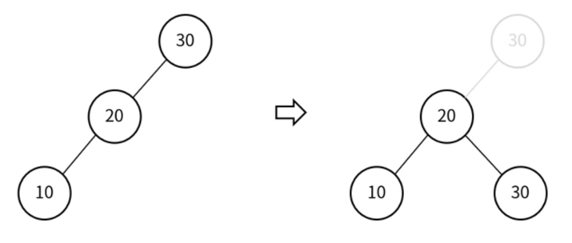
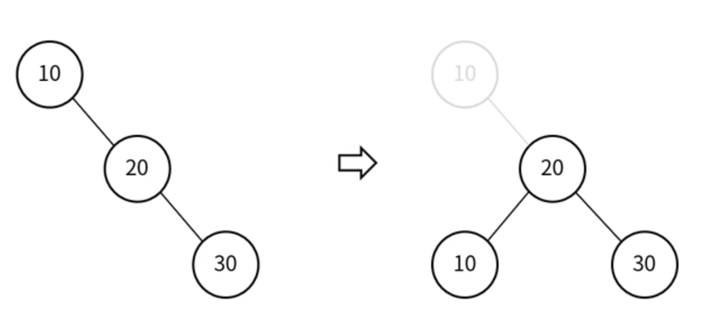
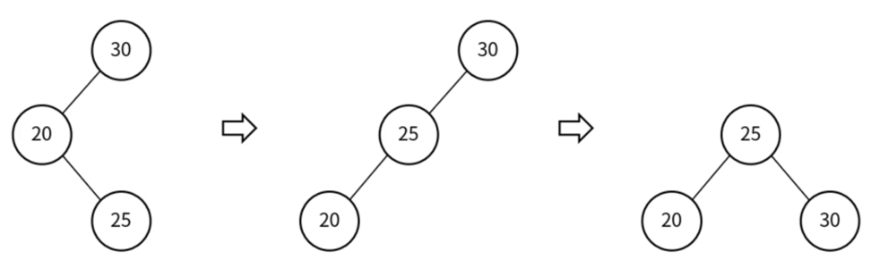
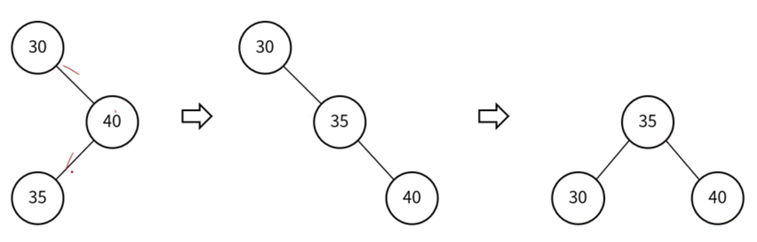
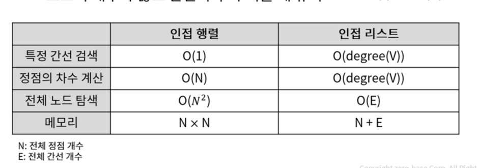

# 이진 탐색트리

## 이진 탐색트리의 삭제 - 자식 노드가 둘 인경우
1. 삭제 대상 노드의 왼쪽 서브 트리에서 가장 큰 노드 선택
2. 삭제 대상 노드의 오른쪽 서브 트리에서 가장 작은 노드 선택
- 1 또는 2에서 선택한 노드를 삭제 대상 노드 위치로 올림
- -> 올리는 과정에서 다른 자식 노드들의 링크 연결 작업 진행 -> 삭제 대상 노드 삭제

# 균형 이진 트리 
- 모든 노드의 좌우 서브트리 높이가 1이상 차이나지 않는 트리 

## 이진 탐색 트리의 편향 발생
- case1) 균형 : 20 -> 10 -> 30 -> 5
- case2) 편향 : 5 -> 10 -> 20 -> 30

## 균형 이진 탐색 트리
- 노드의 삽입과 삭제가 일어날 때 균형을 유지하도록 하는 트리
- AVL 트리, Red-Black 트리

## AVL 트리
- 노드가 삽입, 삭제될 때 트리의 균형을 체크하고 유지하는 트리
- 각 노드의 BF를 -1, 0, 1 만 가지게 하여 균형을 유지
- -> BF (Balance Factor) : 왼쪽서브트리높이 - 오른쪽서브트리높 
### 균형이 깨진 경우
- bf() > 1 => 왼쪽 서브트리에 이상 있음
- bf() < - 1 => 오른쪽 서브트리에 이상 있음
### 리밸런싱(회전 연산)
- 단순 회전 -> LL, RR
- 이중 회전 -> LR, RL
#### 리밸런싱 - LL
- 회전 1회 -> 오른쪽 방향으로 회전 
- **오른쪽 회전 -> 부모 노드를 좌측 자식 노드의 우측 자식으로**

#### 리밸런싱 - RR
- 회전 1회 -> 왼쪽 방향으로 회전
- **왼쪽 회전 -> 부모 노드를 우측 자식 노드의 좌측 좌식으로**

#### 리밸런싱 - LR
- 회전 2회 -> 왼쪽 회전 후 오른쪽 회전

- #### 리밸런싱 - RL
- 회전 2회 -> 오른쪽 회전 후 왼쪽 회전

# 그래프
- 정점과 간선으로 이루어진 자료구조 (Cyclic)
- 연결된 정점간의 관계를 표현할 수 있는 자료구
## 용어
- 정점의 차수 : 무방향 그래프에서 하나의 정점에 인접한 정점 수
- **무방향 그래프 모든 정점의 차수 합 = 그래프 간선의 수 2배**

## 종류
- 가중치 그래프
- 완전 그래프 : 정점이 N개인 경우, 간선의 수는 n(n-1)/2

## 그래프 탐색 - DFS
- 깊이 우선 탐색
- **배열과 스택을 사용**
- 배열 : 각 노드에 방문했는지 여부를 체크
- 스택 : 노드 방문 순서 저장

## 그래프 탐색 - BFS
- 너비 우선 탐색
- **배열과 큐 사용**
- 배열 : 각 노드에 방문했는지 여부를 체크
- 큐 : 노드 방문 순서 저장 

## 그래프의 구현 - 인접 행렬
- 2차원 배열 이용
- 장점) 간선 정보의 확인과 업데이트가 빠름 O(1)
- 단점) 인접 행렬을 위한 메모리 공간 차지

## 그래프의 구현 - 인접 리스트
- 연결 리스트 이용
- 장점) 메모리 사용량이 적고, 노드의 추가, 삭제 빠름
- 단점) 간선 정보 확인이 상대적으로 오래 걸림.

## 인접 행렬 VS 인접 리스트 비교
- 인접 행렬 : 노드의 개수가 적고 간선의 수가 많을 때 유리 (밀집 그래프)
- 인접 리스트 : 노드의 개수가 많고 간선의 수가 적을 때 유리 (희소 그래프)

- 
### 인접 행렬 시간 복잡도
- 특정 간선 검색 : O(1)
- 정점의 차수 계산 : O(N)
- 전체 노드 탐색 : O(N^2)
- 메모리 : N x N
### 인접 리스트 시간 복잡도 (E는 전체 간선 개수)
- 특정 간선 검색 : O(degree(V))
- 정점의 차수 계산 : O(degree(V))
- 전체 노드 탐색 : O(E)
- 메모리 : N + E 