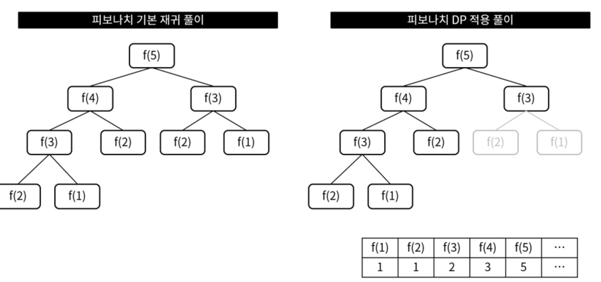

# 알고리즘 이론

## 정렬

### 기수 정렬 (Radix Sort)

- 낮은 자리 수부터 정렬하는 방식
- 각 원소간의 비교연산을 하지 않는 대신 기수 테이블을 위한 메모리 필요 (기수테이블은 Queue)
- 알고리즘 복잡도 : O(dn) -> d는 최대자릿수

### 계수 정렬 (Counting Sort)

- 숫자끼리 비교하지 않고 카운트를 세서 정렬하는 방식
- 카운팅을 위한 메모리 필요
- 알고리즘 복잡도 : O(n + k) -> k는 정렬 대상 데이터 중 최대 값

### 셸 정렬 (Shell Sort)

- 삽입 정렬의 약점을 보완한 정렬 방식
- 삽입 정렬의 약점 -> 오름차순 정렬 기준, 내림차순으로 구성된 데이터에 대해서는 앞의 데이터와 하나씩 비교하며 모두 교환 필요
- 이전의 모든 데이터와 비교하지 않고 일정 간격을 두어 비교
- 알고리즘 복잡도 : O(n^2) -> 간격 설정에 따라 worst case는 삽입정렬과 동일, 일반적인 산포 데이터 기준으로 삽입정렬보다 빠르다
  

# 투포인터

- 배열에서 두개의 포인터를 사용하여 원하는 결과를 얻는 방법
- 두 개의 포인터의 배치 방법
-
    1. 같은 방향에서 시작 : 첫 번째 원소에 둘 다 배치
-
    2. 서로 다른 방향에서 시작 : 첫 번째 원소와 마지막 원소에 배치
- -> 다중 for문의 복잡도를 좀 더 선형적으로 풀 수 있다

# 그리디

- 매순간 현재의 기준으로 최선의 답을 선택해 나가는 기법
- 빠르게 근사치를 계산할 수 있다
- 결과적으로 최적해가 아닐 수 있다

## 그리디 예시

-
    1. Activity Selection Problem
- N개의 활동과 각 활동의 시작/종료 시간이 주어졌을 때, 한 사람이 최대한 많이 할 수 있는 활동의 수 구하기
- -> 종료시간 기준으로 정렬하여 먼저 종료되는 활동 순, 겹치지 않는 순으로 선택한다.
-
    2. 거스름돈 문제
- 잔돈 890, 동전 종류 10, 50, 100, 500 일 때 동전의 수를 가장 적게 고르기
- -> 큰 동전부터 계산

## 그리디 적용 조건

- 그리디 알고리즘은 빠르지만 최적해를 보장하지 못함
- 하기 두가지 조건에 해당하는 경우 적용 가능
-
    1. 탐욕적 특성 : 지금 선택이 다음 선택에 영향을 주지 않음 -> Activity Selection Problem (종료시간 끼리는 선택에 영향이 없다)
-
    2. 최적 부분 구조 : 전체 문제의 최적해는 부분 문제의 최적해로 이루어짐 --> 거스름돈 문제

# 분할 정복

- 큰 문제를 작은 부분 문제로 나누어 해결하는 방법
- 합병 정렬, 퀵 정렬, 이진 탐색...
- 분할 정복 과정
- -> 문제를 하나 이상의 작은 부분들로 분할
- -> 부분들을 각각 정복
- -> 부분들의 해답을 통합하여 원래 문제의 답을 구함

## 분할 정복 장단점

- 장점
- -> 문제를 나누어 처리하기 어려운 문제를 해결
- -> 병렬 처리에 이점이 있음
- 단점
- -> 메모리를 많이 사용 (재귀 호출 구조)

# 다이나믹 프로그래밍

- 주로 타임오버가 나는 경우에 DP로 풀어야하는 경우가 있음
- 큰 문제를 부분 문제로 나눈 후 답을 찾아가는 과정에서, **계산된 결과를 기록하고 재활용**하여 문제의 답을 구하는 방식
- 중간 계산 결과를 기록하기 위한 **메모리**가 필요
- 한 번 계산한 부분을 다시 계산하지 않아 속도가 빠름

## 분할 정복과의 차이

- 분할 정복은 부분 문제가 중복되지 않음
- -> **DP는 부분 문제가 중복되어 재활용**에 사용

## 그리디와 차이

- 그리디는 순간의 최선을 구하는 방식 (근사치)
- ** DP는 모든 방법을 확인** 후 최적해 구하는 방식

## DP 예시

- 피보나치
  
- 부분 문제가 중복되어 재활용 된다 !

## DP 방법 - 타뷸레이션 VS 메모이제이션

### 타뷸레이션 -> for문 이용

- 상향식 접근 방법
- 작은 하위 문제부터 풀면서 올라감
- 모두 계산하면서 차례대로 진행

### 메모이제이션 -> 재귀 이용

- 하향식 접근 방법
- 큰 문제에서 하위 문제를 확인해가며 진행
- 계산이 필요한 순간 계산하며 진행

# 백트래킹

- 모든 경우의 수를 탐색하여 최적해를 구하는 과정에서 유망하지 않은 쪽을 더 이상 구하지 않는 방법
- 돌다리도 두드려보고 가는 느낌
- 용어
- 유망 (Promising) : 해가 될 가능성이 있는 경우 유망하다고 함
- 가지치기 (Pruning) : 해가 될 가능성이 없는 경우 해당 노드를 제외하는 것
- 백트랙킹 (Backtracking) : 유망하지 않은 쪽으로 가지 않고 되돌아 오는 것
- -> 재귀함수 & DPS 활용

# 최단경로 알고리즘 - 1 다익스트라

- 가중 그래프 상의 두 노드를 연결하는 가장 짧은 경로는 찾는 방법
- 지도 경로 탐색, 네트워크 구축에 드는 비용을 최소화 하는데 사용
- 최단경로 알고리즘 종류 : 다익스트라, 벨만-포드, 플로이드-워셜

## 다익스트라 알고리즘

- 출발점에서 목표점까지의 최단 경로를 구하는 알고리즘
- 한 노드에서 다른 모든 노드로의 최단 경로를 구할 수 있음
- 간선에 음의 가중치가 없어야함
- 그리디 + DP 형태
- 알고리즘 복잡도 O(ElogV)

## 다익스트라 풀이

- 노드와 간선 가중치 정보가 있을 때
- 최단 경로 업데이트용 메모리가 필요함
- -> 메모리의 거리 값을 무한대로 초기화
- -> 타겟노드 본인은 0, 본인과 연결관 노드의 가중치 정보를 메모리에 업데이트
- -> 타겟에서부터 **최소 거리 노드로 이동**하면서 각 위치에서의 가중치를 메모리와 비교하여 **최소값 저장 반복**

# 최단경로 알고리즘 - 2 벨만포드

- 음수간선이 포함되어 있어도 최단거리 구할 수 있음 -> 음수 사이클이 있으면 정상 동작 하지는 않음
- 매번 모든 간선을 확인하기 때문에 다익스트라에 비해 느림
- 알고리즘 복잡도: O(VE)
- cf) 다익스트라 우선순위큐로 구현 시 음수 간선 풀 수 있는 문제도 있음.

## 벨만포드 풀이

- -> 다익스트라가 최소값에 대한 가중치만 진행한다면 **벨만포드는 매번(v+1 번) 모든 간선의 가중치값를 비교**
- 노드와 간선 가중치 정보가 있을 때
- 타겟노드에서 다른 노드들에 대한 최단 거리 구하기
- 음수 사이클 체크 -> v + 1번 돌려보고 v 번과 결과가 달라지면 음수 사이클이 존재하는 것!
