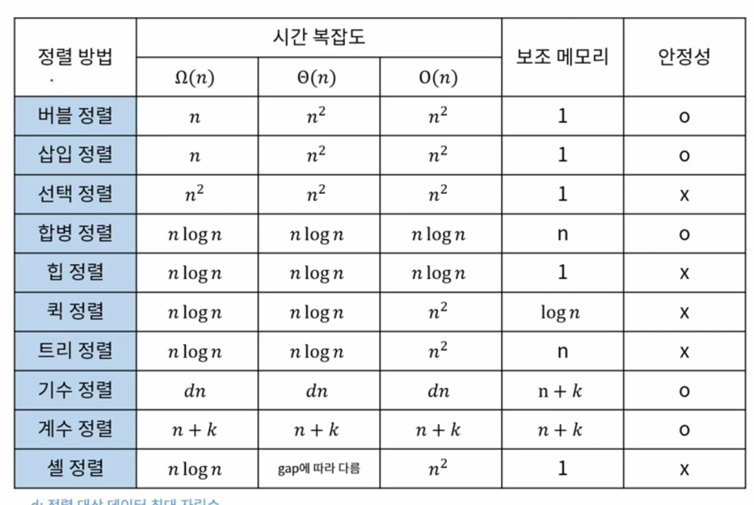

# 알고리즘 이론

## 정렬

### 기수 정렬 (Radix Sort)
- 낮은 자리 수부터 정렬하는 방식
- 각 원소간의 비교연산을 하지 않는 대신 기수 테이블을 위한 메모리 필요 (기수테이블은 Queue)
- 알고리즘 복잡도 : O(dn) -> d는 최대자릿수

### 계수 정렬 (Counting Sort)
- 숫자끼리 비교하지 않고 카운트를 세서 정렬하는 방식
- 카운팅을 위한 메모리 필요
- 알고리즘 복잡도 : O(n + k) -> k는 정렬 대상 데이터 중 최대 값

### 셸 정렬 (Shell Sort)
- 삽입 정렬의 약점을 보완한 정렬 방식
- 삽입 정렬의 약점 -> 오름차순 정렬 기준, 내림차순으로 구성된 데이터에 대해서는 앞의 데이터와 하나씩 비교하며 모두 교환 필요
- 이전의 모든 데이터와 비교하지 않고 일정 간격을 두어 비교
- 알고리즘 복잡도 : O(n^2) -> 간격 설정에 따라 worst case는 삽입정렬과 동일, 일반적인 산포 데이터 기준으로 삽입정렬보다 빠르다
